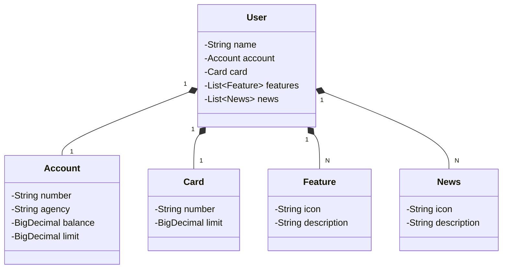

# Projeto RESTful API com Spring Boot Web
### Desenvolvido durante o Bootcamp Backend em Java na plataforma DIO.

Projeto se trata de uma API que realiza inserção, remoção e requisição de um usuário de um aplicativo de banco.
No qual possui os dados de nome do usuário, informações da conta bancária (número, agência, etc.), 
informações de cartão (número, limite), opções da conta (features) e notícias (news) que possam ser interessantes.

### Tecnologias Usadas:
- Java 17
- Spring Boot 3.3
- Spring Data JPA
- PostgresSQL 
- H2 Database
- OpenAPI WebMVC UI (Swagger)
- Railway (deploy)

#### Diagrama de Classes (Sintaxe Mermaid)

Para deploy da API e do banco Postgres, foi utilizado o [Railway](https://railway.app/).

Acesso à API (com Swagger/OpenAPI):
https://api-springboot-prod.up.railway.app/swagger-ui/index.html
